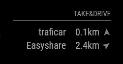

# MMM-TakeAndDrive



This is a module for the [MagicMirror²](https://github.com/MichMich/MagicMirror/).

Shows closest carsharing vehicles from TakeAndDrive.eu - includes cars, scooters, bikes etc.

## Using the module

To use this module, add the following configuration block to the modules array in the `config/config.js` file:
```js
var config = {
    modules: [
        {
            module: 'MMM-TakeAndDrive',
            header: 'Take&Drive',
            position: 'bottom_right',
            config: {
                lat: 52.409538,
                lon: 16.931992,
                city: 'poznan',
		        providers: ["traficar", "easyshare", "lime", "blinkee", "jedenslad"],
                updateInterval: 120000
            }
        }
    ]
}
```

## Configuration options

| Option           | Description
|----------------- |-----------
| `city`           | *Required* 'poznan', 'krakow' or other (check https://takeanddrive.eu/api/v1/cities for city names)
| `lat`            | *Required* latitude of your location
| `lon`            | *Required* longitude of your location
| `providers`      | *Required* providers to show (check https://takeanddrive.eu/api/v1/vehicles?city=poznan with your city in url for provider names)
| `updateInterval` | *Optional* update interval in miliseconds (default: 600000 - 10 min)